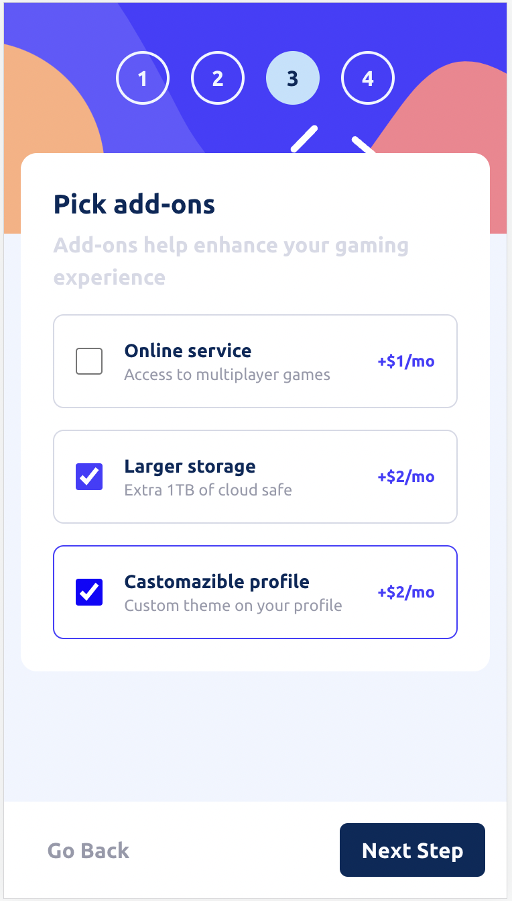

# Frontend Mentor - Multi-step form solution

This is a solution to the [Multi-step form challenge on Frontend Mentor](https://www.frontendmentor.io/challenges/multistep-form-YVAnSdqQBJ). Frontend Mentor challenges help you improve your coding skills by building realistic projects.

- Live Site on Vercel: [https://multi-step-form-dun.vercel.app/](https://multi-step-form-dun.vercel.app/)

## Table of contents

- [Overview](#overview)

- [The challenge](#the-challenge)

- [Screenshot](#screenshot)

- [Links](#links)

- [My process](#my-process)

- [Built with](#built-with)

- [What I learned](#what-i-learned)

- [Continued development](#continued-development)

- [Useful resources](#useful-resources)

- [Author](#author)

- [Acknowledgments](#acknowledgments)

## Overview

### The challenge

Users should be able to:

- [ ] Complete each step of the sequence

- [ ] Go back to a previous step to update their selections

- [ ] See a summary of their selections on the final step and confirm their order

- [ ] View the optimal layout for the interface depending on their device's screen size

- [ ] See hover and focus states for all interactive elements on the page

- [ ] Receive form validation messages if:

- [ ] A field has been missed

- [ ] The email address is not formatted correctly

- [ ] A step is submitted, but no selection has been made

### Screenshot

### Links

- Solution GitHub: [https://github.com/vasily-mishanin/multi-step-form](https://github.com/vasily-mishanin/multi-step-form)

- Live Site on Vercel: [https://multi-step-form-dun.vercel.app/](https://multi-step-form-dun.vercel.app/)

## My process

### Built with

- Semantic HTML5 markup

- SCSS custom properties

- Flexbox

- Mobile-first workflow

- [React](https://reactjs.org/) - JS library

- [Vite](https://vitejs.dev/) - builder

### What I learned

In this challenge I've learned how to build multistep form.
I wrapped it into single component StepForm. This StepForm wrapped two another components: StepsSection and Form.
StepsSection - for displaying steps.
Form - wrapper for form and controls
There is just one single form.
I build useMultiStepForm custom hook to manage steps and subforms, which are rendered inside form. These subform are just various inputs in special wrapper;
The state management is being made inside StepForm;
Each Input.. component from subforms independently validates and updates the state via props callbacks.
Next disabling managed by forms iAmValid functions, logic is different.

### Continued development

Finished for now

### Useful resources

- [Web Dev Simplified](https://www.youtube.com/@WebDevSimplified) - This helped me to build and use useMultiStepForm custom hook.

## Me

- Website - [vasmish.com](https://vasmish.com/)

- Frontend Mentor - [@vasily-mishanin](https://www.frontendmentor.io/profile/vasily-mishanin)

- Twitter - [@MishaninVasily](https://twitter.com/MishaninVasily)

## Acknowledgments

- [Web Dev Simplified](https://www.youtube.com/@WebDevSimplified) - This helped me to build and use useMultiStepForm custom hook.
